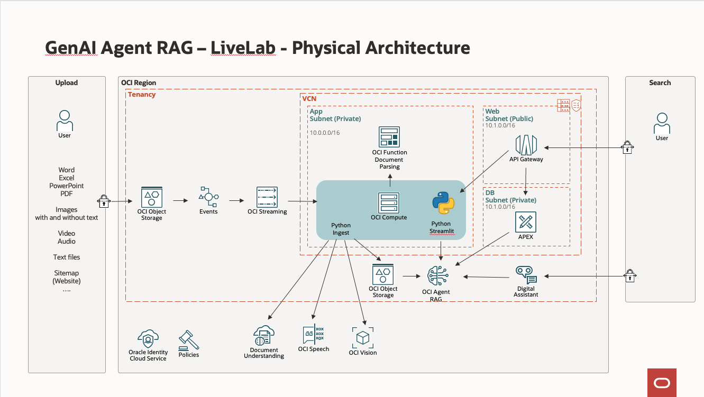

# Introduction

## About This Workshop
We will extend the features of Oracle Generative AI Agent RAG. The sample code will allow 
- to search documents like Word/Excel, Images, Video, Audio or Websites (using sitemaps)
- to build a custom user interface with: 
    - Oracle Digital Assistant
    - APEX
    - A python library Streamlit  
- run ingestion automatically.

The installation uses Terraform.

We’ll be able to search documents like:
- Video and Audio files using OCI Speech
- Images using OCI Vision
- TIF files (FAX) using OCI Document Understanding
- Word, Excel, Powerpoint, ... using OCI Functions
- Websites using Sitemap 


From the 3rd lab, we will create 3 user interfaces for the above using the following tools:
- Oracle Digital Assistant
- APEX
- A python library Streamlit  
  
Estimated Workshop Time: 90 minutes

### Logical Architecture

This picture shows the processing flow.


It works like this:
1. A document is uploaded to Object Storage by the user
1. An event is raised and queued. The event is processed by a Python program running on a VM. Based on the file type, it will send the file to one or more AI services to enrich them and provide searchable text
1. The searchable text is the result is uploaded to Object Storage "AGENT"
1. The Generative AI AGENT ingests the new files
1. The user query the Generative AI Agent

Here's how various file types are processed.

- If the file has the extension **.pdf**, **.txt**, **.csv**, **.md**, the file is copied to the AGENT Object Storage.
- If the file has the extension **.png**, **.jpg**, **.jpeg**, or **.gif**, it is processed by OCI Vision. The output is stored in the AGENT Object storage 
- If the file has the extension **.mp4**, **.avi**, **.mp3**, **.wav**, or **.m4a**, it is processed by OCI Speech.
- If the file has the extension **.tif**, it is processed by OCI Document Understanding.
- If the file has the extension **.json**, this is an output of the asynchronous AI services such as OCI Speech or OCI Document Understanding. 
- All other file types like **.doc**, **.docx**, **,xlsx**, **.pptx** are sent to OCI Function with a document parser.

### Physical Architecture

We will install the following architecture using Terraform.



### Objectives

- Provision the services needed for the system
    - Compartment, Object Storage Bucket, Stream, Event, GenAI Agent, AI services and a Virtual Machine
- Create an OCI Function to convert binary documents (like Word/Excel)
- Integrate the components into a working system
- Search for files through several types of user interfaces

## Prerequisites
### Cloud Account
You need an Oracle Cloud account (i.e. access to an OCI tenancy) to complete this workshop. Participants can take advantage of Oracle's free trial account that comes with free cloud credits that are good for 30 days or until used up. 

### Access to Frankfurt, London or Chicago (*)
- *The Cloud Account should have access to the Chicago Region or Frankfurt region* where the Generative AI Agent is available.
    - For Free Trial account, this means that the Free Trial should be created in one of these regions
    - For Paid account, you will need to add one of the abobe region to your tenancy to access the Generative AI APIs. (See lab 1) 

(*) The up-to-date list of regions here: https://docs.oracle.com/en-us/iaas/api/#/en/generative-ai-agents-client/20240531/ 

### Cloud Shell - Public Network

The lab is using Cloud Shell with Public Network
The lab assume that you have access to OCI Cloud Shell with Public Network access.
If that is not the case for some reasons here are the solution.

If you start Cloud Shell and that you see **Network: Public** on the top or that you may change to **Public Network**, there is nothing to do.
OCI Administrator have that right automatically. Or your administrator has maybe already added the required policy.

#### Solution - Add Policy

If not, please ask your Administrator to follow this document:

https://docs.oracle.com/en-us/iaas/Content/API/Concepts/cloudshellintro_topic-Cloud_Shell_Networking.htm#cloudshellintro_topic-Cloud_Shell_Public_Network

He/She just need to add a Policy to your tenancy :

```
<copy>
allow group <GROUP-NAME> to use cloud-shell-public-network in tenancy
</copy>
```

**Please proceed to the [next lab.](#next)**

## Acknowledgements 

- **Author**
    - Marc Gueury, Generative AI Specialist
    - Anshuman Panda, Generative AI Specialist
    - Maurits Dijkens, Generative AI Specialist