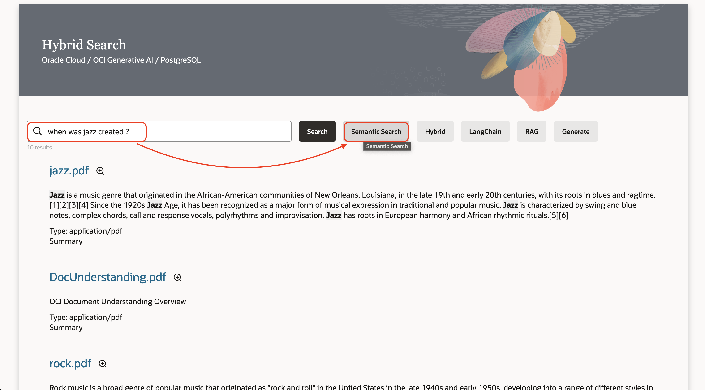
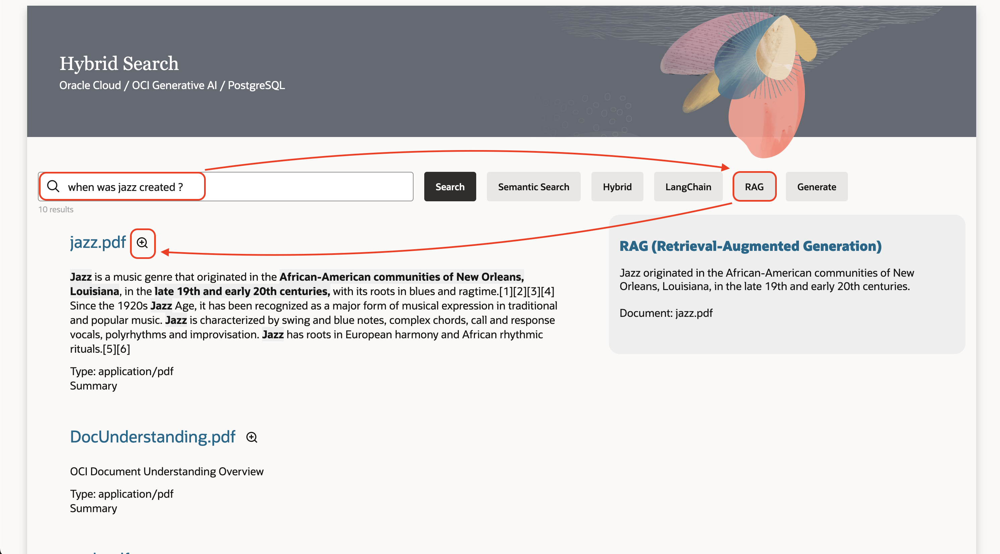
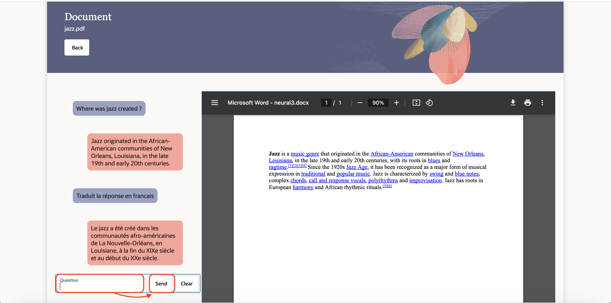

# Integrate the Components

## Introduction
In this lab, we will the OCI GenAI Agent created in Lab1
Estimated time: 10 min

### Objectives

- Test the program

### Prerequisites
- The previous lab must have been completed.

## Task 2: Upload the sample files

Please wait that the script from the previous lab finishes. You should see :

```
<copy>
    APEX APP
    https://abcdefghijklmnop.apigateway.eu-frankfurt-1.oci.customer-oci.com/ords/r/apex_app/apex_app/
    User: APEX_APP / YOUR_PASSWORD
</copy>
```
    
1. Go to the url above (ex:https://abcdefghijklmnop.apigateway.eu-frankfurt-1.oci.customer-oci.com/ords/r/apex_app/apex_app/)

    Login as APEX_APP / YOUR_PASSWORD
    
1. Type "when was jazz created", then *Enter*

        

1. Type "what is Oracle Anaytics", then *Enter*

      

1. In the previous screen click on Zoom of the jazz document. Then let's chat about that single document.
   
    - Type "Where was jazz created ?", then *Send*
    - Type "traduit la réponse en Francais", then *Send*

              

## Task 3: Optional - Test additional files
This is an optional test you can run with more sample files. If you do this test, you will have more content in the database. If you're running short of time, then you can skip it or come back to it later.

**You may now proceed to the [next lab.](#next)**

## Known issues

None

## Acknowledgements

- **Author**
    - Marc Gueury, Generative AI Specialist
    - Anshuman Panda, Generative AI Specialist
    - Maurits Dijkens, Generative AI Specialist

